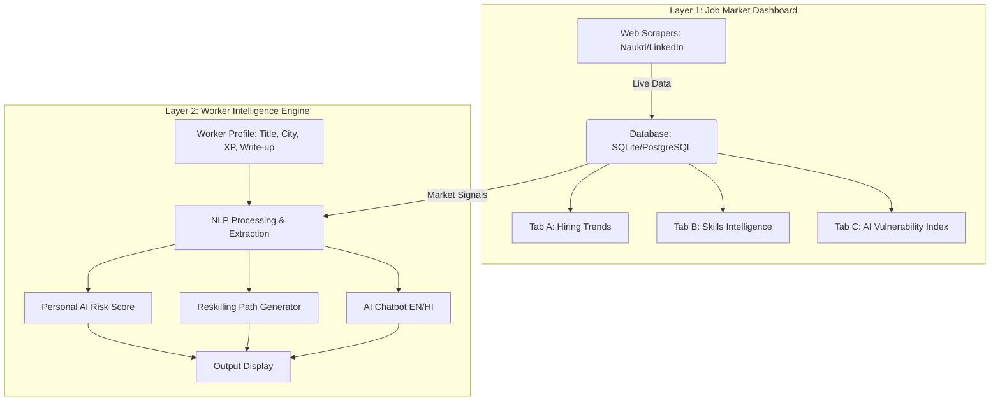

# Skills Mirage - Implementation Log & Architecture

## System Architecture

The system is divided into two main layers that communicate in real-time.

## Data Pipeline Flow

1. **Scraping**: `backend/scraper.py` runs periodically or on-demand to fetch job listings for target cities and roles. It extracts job title, skills, location, and tools mentioned.
2. **Analysis**: The scraped data is processed to calculate:
   - Hiring volume trends (7d, 30d, etc. - mocked dynamically for the demo timeframe).
   - Rising/declining skills.
   - AI Vulnerability Index (based on mentions of AI tools in JDs and hiring volume decline).
3. **Storage**: Data is stored in a relational database (`skills_mirage.db` SQLite for easy demo setup).
4. **Worker Input**: The frontend takes user details. The Write-up is processed using NLP (TF-IDF/Spacy/LLM) to extract implicit skills.
5. **Scoring**: The worker's extracted skills and role are matched against Layer 1's Vulnerability Index to compute a personalized Risk Score.
6. **Reskilling**: Based on the skill gap (Required Skills in City - Worker Skills), a path is generated using a local database of SWAYAM/NPTEL courses.

## Chatbot Response Templates & Logic

The chatbot uses context-aware prompting. 
**System Prompt:**
"You are a career advisory AI for the Indian workforce. You have access to the user's profile and live market data. Answer the user's question accurately based on the provided context. If the user speaks Hindi, reply in Hindi."

**Question Types:**
1. *Why is my risk score so high?* -> Uses context: User Score, City Hiring Trends, AI Tool Mentions in JD.
2. *What jobs are safer for someone like me?* -> Queries DB for low AI-vulnerability roles with similar skill overlap.
3. *Show me paths that take less than 3 months* -> Filters course database by duration < 12 weeks.
4. *How many BPO jobs are in Indore right now?* -> Direct SQL query to `job_listings` table where city='Indore' and role='BPO'.
5. *मुझे क्या करना चाहिए? (Hindi)* -> Translates input/output, provides a holistic summary of risk and next steps.

## Deployment Instructions

1. Install dependencies: `pip install -r requirements.txt`
2. Set API keys: `export GEMINI_API_KEY="your_api_key"` (for the chatbot LLM).
3. Run the backend server (FastAPI): `uvicorn backend.main:app --reload`
4. Run the frontend (Streamlit): `streamlit run frontend/app.py`

## Step-by-step Implementation Plan

1. **Setup**: Directory structure and `requirements.txt`.
2. **Database & Mock Scraper**: Set up SQLite schema. Create a scraper that populates realistic demo data (since live scraping Naukri/LinkedIn during a demo might hit captchas, we will implement a scraper script that can fall back to generating realistic synthetic data simulating live updates).
3. **Backend API**: FastAPI endpoints for Layer 1 (Dashboard stats) and Layer 2 (Risk score, Reskilling).
4. **NLP & Chatbot**: Implement skill extraction and a LangChain/GenAI based chatbot endpoint.
5. **Frontend**: Streamlit app with Dashboard tabs and a Worker profile + Chatbot interface.
6. **Integration & Testing**: Ensure Layer 1 changes affect Layer 2 live.
